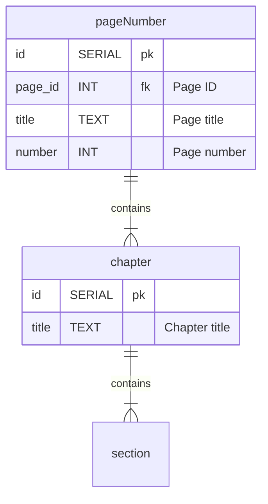

# SQC-Project
Bradley Hayes

My name and link to GitHub repo with light and dark mode implemented.

https://sqc-project-zntq.onrender.com

---
Entity Relationship Diagram
---

   Hello from JENNIFER
